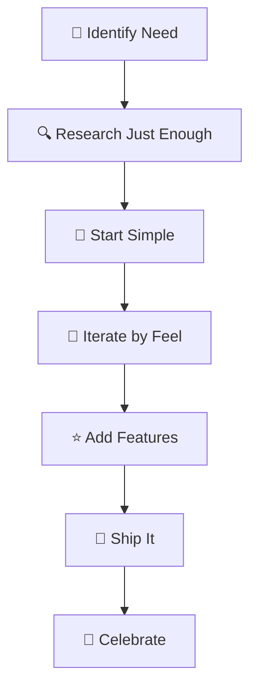

# 🌊 Vibe Coding Collection

<div align="center">


---

> *"When you need it to exist, but don't need to understand it"*

[](https://github.com/ADPer0705/vibe-coding)
[](https://github.com/ADPer0705/vibe-coding)

</div>

---

## 📋 Table of Contents

- [🎯 The Vibe Coding Philosophy](#-the-vibe-coding-philosophy)
- [🚀 Projects](#-projects)
- [🎨 The Vibe Coding Methodology](#-the-vibe-coding-methodology)
- [🛠 Getting Started](#-getting-started)
- [🌟 Why Vibe Coding Works](#-why-vibe-coding-works)
- [🤝 Contributing](#-contributing)
- [📝 License](#-license)
- [🙏 Acknowledgments](#-acknowledgments)

---

A curated collection of projects built through the art of **vibe coding** – that magical state where functionality emerges through intuition, Stack Overflow wizardry, and the pure will to make things work without diving deep into the theoretical rabbit holes.

## 🎯 The Vibe Coding Philosophy

Sometimes you just need something to **exist**. You have a clear vision of what you want, but you don't want to spend months learning every architectural pattern or best practice. You want to channel your inner developer shaman, trust the process, and vibe your way to a working solution.

This repository houses those beautiful, functional chaos projects that were born from necessity and shaped by experimentation.

## 🚀 Projects

<div align="center">

### 📱 [ADB Data Fetcher](./ADB_Data_Fetcher)

<div align="center">


</div>

**The Need:** This was my final project for my .NET class in sem 4. *"I need to extract data from Android devices but I don't want to become a mobile dev just for this one assignment."*

**The Vibe:** Windows Forms + ADB + Entity Framework = Data extraction magic ✨

<div align="center">

| Feature | Description |
|---------|-------------|
| 📨 **SMS Extraction** | Pull all your text messages |
| 👥 **Contacts** | Export your phone book |
| 📞 **Call Logs** | History of all calls |
| 📱 **Device Info** | Hardware and software specs |
| 👤 **Accounts** | System account details |

</div>

**Tech Stack:** `C#` • `.NET 8.0` • `Windows Forms` • `Entity Framework Core` • `SQL Server`

---

### 📺 [Telegram Download Manager](./telegram-download-manager)

<div align="center">


</div>

**The Need:** A reliable way to download files from Telegram with proper queue management and resumption. *"Why does every download manager suck at the one job it's supposed to do?! Stop failing every time I minimize the window!"*

**The Vibe:** Python + Tkinter + TDLib = Download everything, beautifully 🎨

<div align="center">

| Feature | Description |
|---------|-------------|
| 🔄 **Queue Management** | Robust download queues with retry logic |
| 🖼️ **Beautiful GUI** | Interface that doesn't make you cry |
| ⚡ **Resume Downloads** | Pick up where you left off |
| 🔗 **API Integration** | Seamless Telegram integration |
| 🌙 **Background Mode** | Works without supervision |

</div>

**Tech Stack:** `Python 3.8+` • `Tkinter` • `TDLib` • `SQLite`

---

### 🚀 [Parsec](./parsec)

<div align="center">


</div>

**The Need:** A single-window terminal experience that bridges natural language and shell commands. *"I want an AI co-pilot for my terminal, but I don't trust it to run commands without my approval."*

**The Vibe:** Rust + AI + Safety-first design = The terminal of the future 🛡️

<div align="center">

| Feature | Description |
|---------|-------------|
| 🧠 **Smart Classification** | Distinguishes shell commands from natural language |
| 🛡️ **Safety First** | No AI-generated command executes without approval |
| 📋 **Workflow Planning** | AI breaks down complex tasks into reviewable steps |
| 🔌 **Pluggable Models** | Support for different AI providers |
| 🐍 **Python Integration** | Embedded Python for local classification |

</div>

**Tech Stack:** `Rust` • `Python` • `AI Models` • `Terminal UI`

</div>

## 🎨 The Vibe Coding Methodology

<div align="center">



</div>

The ancient art passed down through Stack Overflow threads and late-night coding sessions:

<div align="center">

| Step | Description | Vibe Level |
|------|-------------|------------|
| **🎯 Identify the need** | "I wish this existed" → *proceeds to make it exist* | 🔥🔥🔥 |
| **🔍 Research just enough** | Stack Overflow, docs skimming, AI assistance, YouTube tutorials at 2x speed | 📚📚 |
| **🚀 Start with the simplest version** | Make it work first, make it pretty never (but somehow it ends up working well) | ⚡⚡⚡ |
| **💫 Iterate through feelings** | If it feels wrong, try another approach. Trust the vibe. | 🎯🎯 |
| **⭐ Add features until satisfied** | Stop when it does what you need (resist the urge to over-engineer) | ✨✨ |
| **🚢 Ship it** | Perfect is the enemy of good enough. Done is better than perfect. | 🎉🎉🎉 |

</div>

## 🛠 Getting Started

<div align="center">

### Quick Setup Guide

```bash
# 🌟 Clone the repository
git clone https://github.com/ADPer0705/vibe-coding.git
cd vibe-coding

# 🔧 Initialize submodules (because that's how we roll with multi-project vibes)
git submodule update --init --recursive

# 🎮 Pick your adventure
cd ADB_Data_Fetcher           # 📱 For Android data extraction vibes
cd telegram-download-manager  # 📺 For Telegram download mastery
```

</div>

<div align="center">

> 💡 **Pro Tip:** Each project directory has its own README with specific setup instructions. We believe in organized chaos.

</div>

---

<div align="center">

## 🎯 Project Status

| Project | Status | Last Updated |
|---------|--------|--------------|
| [ADB Data Fetcher](./ADB_Data_Fetcher) | ✅ Working | Semester 4 Final |
| [Telegram Download Manager](./telegram-download-manager) | ✅ Working | Latest |

</div>

## 🌟 Why Vibe Coding Works

<div align="center">

| Advantage | Description | Impact |
|-----------|-------------|--------|
| **⚡ Speed over perfection** | Get to MVP faster than your attention span fades | 🚀 |
| **🎓 Learning through doing** | Understand concepts by breaking them (and fixing them) | 🧠 |
| **🛠️ Pragmatic problem solving** | Focus on solutions, not academic purity | 🎯 |
| **🎨 Creative exploration** | Try unconventional approaches that "shouldn't work" but do | ✨ |
| **✨ Functional minimalism** | Build exactly what you need, nothing more, nothing less | 🎪 |
| **🧠 Intuitive development** | Sometimes your gut knows better than the documentation | 💫 |

</div>

<div align="center">

> 💡 **The Vibe Coding Promise:** If it works and solves your problem, it's good enough. No over-engineering, no unnecessary complexity, just pure functionality.

</div>

## 🤝 Contributing

<div align="center">

### Ways to Contribute

| Type | Description | How to Help |
|------|-------------|-------------|
| 🐛 **Bug Reports** | Found something broken? | [Open an Issue](https://github.com/ADPer0705/vibe-coding/issues) |
| 💡 **Feature Requests** | Have a cool idea? | [Create a Discussion](https://github.com/ADPer0705/vibe-coding/discussions) |
| 🔧 **Code Contributions** | Want to improve something? | Fork → Code → PR |
| 🎨 **Vibe Projects** | Built something cool? | Add it as a submodule! |

</div>

<div align="center">

> 📝 **Remember:** While these projects were born from personal necessity, improvements are always welcome. Just remember the core philosophy: **keep it simple, keep it working, keep the vibe alive**.

</div>

## 📝 License

Each project may have its own licensing terms. Check individual project folders for specific license information.

## 🙏 Acknowledgments

<div align="center">

### The Real MVPs

| Contributor | Role | Impact |
|-------------|------|--------|
| **Stack Overflow** | Silent Co-author | 🏆 The real MVP of every project |
| **Documentation Writers** | Knowledge Providers | 📚 Even when we only read 20% of it |
| **AI Assistants** | Patient Teachers | 🤖 For explaining things when we're too proud to ask humans |
| **Programming Community** | Inspiration Source | 🌍 Making complex things seem possible with enough coffee |
| **YouTube Tutorials** | Quick Learners | 📺 Specifically the ones that skip theory and jump to "here's how you do it" |
| **Error Messages** | Harsh Teachers | 💥 Our most effective debugging mentors |

</div>

---

<div align="center">

## 📞 Connect With Me

<div align="center">

[](https://github.com/ADPer0705)
[](https://linkedin.com/in/dearanayji)
[](https://x.com/ADPer_00_0111)

</div>

---

> 📝 **Meta Note:** This README itself is vibe-coded markdown – assembled through trial, error, emoji intuition, and the ancient art of "does this look cool enough?" ✨

<div align="center">

---

*Built with curiosity, powered by caffeine, debugged through determination, documented through vibes.*

**Happy vibing! 🌊✨**

---

<div align="center">

```text
   🌊     🌊     🌊
 🌊   🌊 🌊   🌊   🌊
🌊     🌊     🌊
   🌊     🌊     🌊
 🌊   🌊 🌊   🌊   🌊
🌊     🌊     🌊
```

**Keep the vibe alive! 🎨✨**

</div>

</div>
